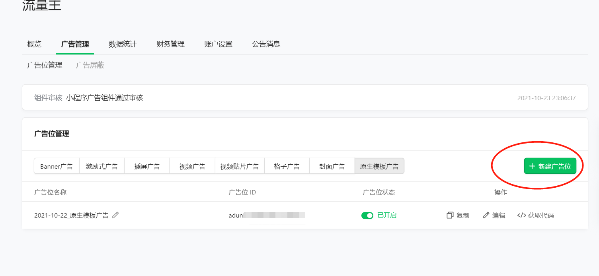
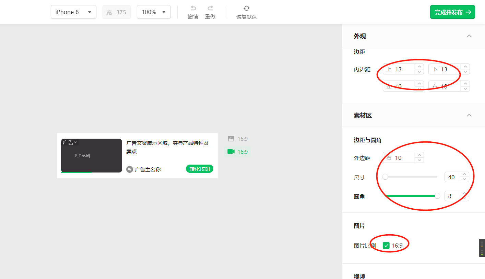
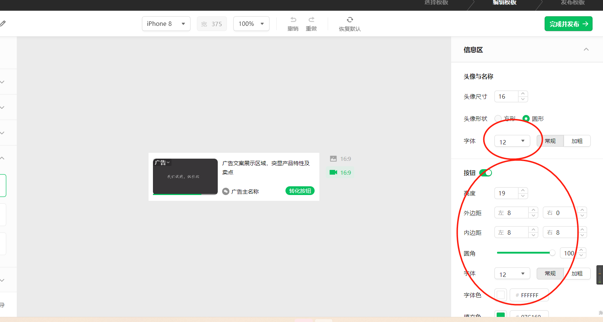
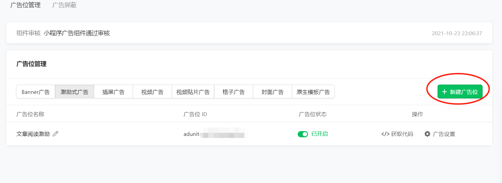

# 简介须知

此微信小程序是基于开源博客Halo提供的API开发，使用的前提是自己已经部署有自己的Halo博客网站。
- 文档地址：[http://mbhdoc.wangsrbus.cn](http://mbhdoc.wangsrbus.cn/#/)
- 微信小程序使用api必须是https，因此需要自己的博客网站配置ssl证书。
- 下载后直接微信小程序开发工具打开即可。
- 在app.js配置acess_key以及线上api地址
-  联系方式（bug或者新功能添加请在仓库issue中提出）


## 小程序
<div>

</div>

-----


## Halo开源博客地址

- [halo官网](https://halo.run/)
- [halo-GitHub地址](https://github.com/halo-dev/halo)

## 参考文档

- [云开发文档](https://developers.weixin.qq.com/miniprogram/dev/wxcloud/basis/getting-started.html)

## 本地或者自己部署线上配置

## **基础配置**

> `项目路径` -> `app.js `文件中

 - `domain`:'https://blog.wangsrbus.cn',//博客地址
 - `baseUrl`: 'https://blog.wangsrbus.cn/api', //博客api地址
 - `api_access_key`:"xxx", //token
 - `loading_img`:"",加载中gift
 - `empty_img`:"",//空白gift
 - `title`:"Hi,I'm suke",//自定义title
 - `shareName`:'suke’s share',//小程序分享名称
 - `openComment`:true,//是否开启评论 true为开启 false为关闭 -----------  云端控制请到halo后台配置系统变量 key:suke_wechat_comment value:show/noshow
 -  `index_art_style`:'card01', //首页最新文章样式 内置：card01/card02
 - `openAd`:true,//流量主开通则打开
 - `unitId`:'xxxxxxxxx',//原生模板广告ID  自定义的时候自己可以选择样式
 - `unitId2`:'xxxxxxxxx',//视频激励广告--用于文章设置观看视频阅读更多功能
 - `customSlug_one_title`:'科技动态',//分类自定义标题 【小程序展示title】
 - `customSlug_one`:'新闻',//分类 【halo文章的分类名称】
  
 - `sheetId`:34,留言板ID----需要数据库去查询或者F12查看网页端留言页面的id或者去后台管理找到页面F12 然后查看network 还不会的话请联系博主帮助

----


## 跳转公众号文章配置

发表文章时在halo后台配置`元数据`：key为 `gzhURL` value为：`公众号文章链接`


## 海报生成的二维码配置

> `项目下路径` > `images` > `wechat-q-code.jpg`替换成自己的二维码   

## 流量主配置

 - 登录后台，开通流量主
 - 按照下面创建`原生模板广告`和`激励式广告`

> `原生模板广告`,注意修改样式 保证和文章列表渲染匹配
 
 
 
 

> **激励式广告，这个和halo文章设置元数据有关，因为需要您在发布文章的时候指定参数如下**

- 微信后台创建广告

  
- halo后台创建元数据
  
  - `showAd`: `true/false`  是否展示激励广告
  - `maxShowHeight` `number类型的数字`  对应文章在展示激励广告时可见内容高度  `不设置默认在1500`
  

 - 复制对应的广告id填写到app.js配置文件中
 
```javascript
     openAd:true,//流量主开通则打开
      unitId:'adunit-11111',//原生模板广告ID  自定义的时候子集可以选择样式
      unitId2:'adunit-22222222',//视频激励广告--用于文章设置观看视频阅读更多功能
```

## 鸣谢
 - Halo 高颜值轻便开源个人博客
 - lin-ui 简洁美观的小程序UI组件
 - mp-html 富文本和markdown渲染组件
 - vant 众多人喜欢的小程序渲染组件
 
## License
 MIT
