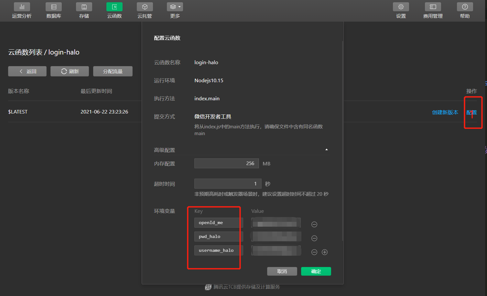

#  小程序配置


## 从git仓库下载[稳定包](https://github.com/wangsrGit119/mini-blog-halo/releases)或者稳定分支[源码](https://github.com/wangsrGit119/mini-blog-halo)，用微信开发工具打开源码
 > `注意：master分支是最新的代码，如果想要体验最新的未发布版本，直接拉取主分支即可，正常来说主分支的代码均可稳定运行`
## **基础配置**

> `项目路径` -> `app.js `文件中

```
    this.globalData = {
      baseUrl: 'https://cxxxxxxxxx.cn/api', //api
      api_access_key:"cxxxxxxxxx", //token
      index_bg_image_url:"https://cdn.jsdelivr.net/gh/wangsrGit119/wangsr-image-bucket/img-article/photo-1507738978512-35798112892c.jfif",//首页背景
      title:"SUKE'S SHARE",//自定义title
      shareName:'suke的个人博客',//小程序分享名称
      userInfo:undefined,//登录用户信息储存处 临时变量
      admin_token: undefined,//临时 token undefined 临时变量
      authorInfo:undefined,//作者信息 临时变量
      myCollectArticle:'myCollectArticle',//云数据库 存放收藏文章
    }
```
   - `baseUrl`：基础的API（halo博客的）
   - `api_access_key` ：博客后台开启api后设置的token
   - `index_bg_image_url`：首页bar背景图片
   - `title` ： 首页展示的标题
   - `shareName`: 朋友圈分享的名称
   - `userInfo`: 基础用户信息，`无需配置`
   - `admin_token` : `无需配置`
   - `authorInfo`: `无需配置`
   - `myCollectArticle`: 微信小程序`云数据库中需要创建的collect`


----

# 云函数配置

> **云函数总共有三个需要在云端安装** ： `login` :用于登录 , `msgseccheck`：敏感词校验 , `login-halo`：halo后台一键登录

## **云函数环境配置①**
 
 > **重要，不配置则小程序无法评论**（因为用到了云函数所以需要在开发控制台[开通云开发](https://mp.weixin.qq.com/wxamp/clouddevelopment/index)，并在app.js配置云环境ID）
 > 云端安装部署`msgseccheck` 云函数
 > 
 
```
 wx.cloud.init({
        // env 参数说明：
        //   env 参数决定接下来小程序发起的云开发调用（wx.cloud.xxx）会默认请求到哪个云环境的资源
        //   此处请填入环境 ID, 环境 ID 可打开云控制台查看
        //   如不填则使用默认环境（第一个创建的环境）
        env: 'ssssssssssssssssss',
        traceUser: true,
      })
```
## **云函数环境配置②**

> **重要：用于配置一键登录管理后台的功能**
>  - 在前面的基础上，云端安装部署`login-halo`云函数
>  - 小程序工具打开云开发控制台->云函数->选择login-halo云函数->打开右边`版本与配置`->列表中打开最新版本的`配置`->点开高级配置->设置三个变量如下：




>参数说明`pwd_halo`:halo的后台密码，`username_halo` halo的后台登录账号,`openId_me` 个人`openID`（每个微信用户特有的，这个地方在交给微信审核前可以配置任意字符串(**审核时必须将上述随机输入的字符串在备注也填上，用于审核人员登录**)，审核完成后，在上述配置的地方改为自己的openId）
> **因为上述账号密码以及openID储存在微信云函数配置中，因此是动态的，后续账号密码换掉了，直接在云开发工具按照上述步骤更改即可。**

##  字体配置(app.wxss)
> **可选操作，默认即可**

> 自定义字体显示**只有一部分特定的中文字体，所有英文，数字**

> 使用过程中如果有**想要单独使用字体**的，后续我可以**添加到字体文件中，然乎发布新的字体链接版本**

```
@font-face {
  font-family: 'CUSTOM_FONT_T_01';
  src: url('https://cdn.jsdelivr.net/gh/wangsrGit119/wangsr-image-bucket/img-article/2021032601fangzhengziji_xingkaijianti.ttf');
}

@font-face {
  font-family: 'CUSTOM_FONT_T_02';
  src: url('https://cdn.jsdelivr.net/gh/wangsrGit119/wangsr-image-bucket/img-article/2020032601jianghaoyingbikaishu.ttf');
}

```
## 海报生成的二维码配置

> `项目下路径` > `images` > `wechat-q-code.jpg`替换成自己的二维码   