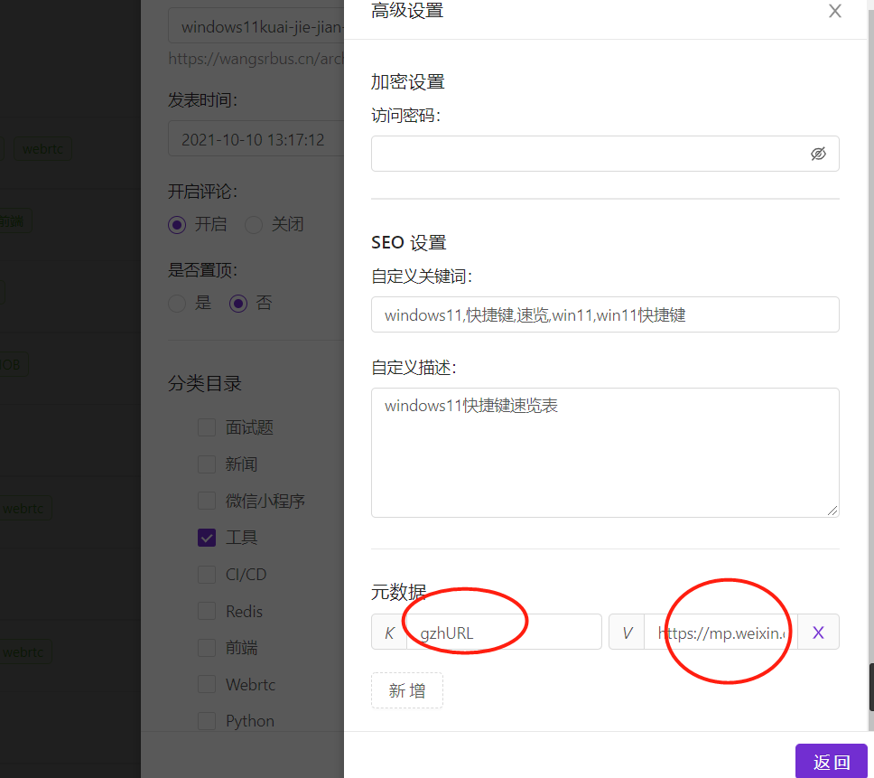
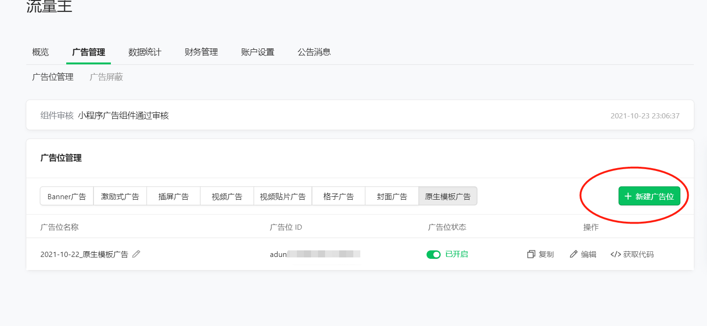
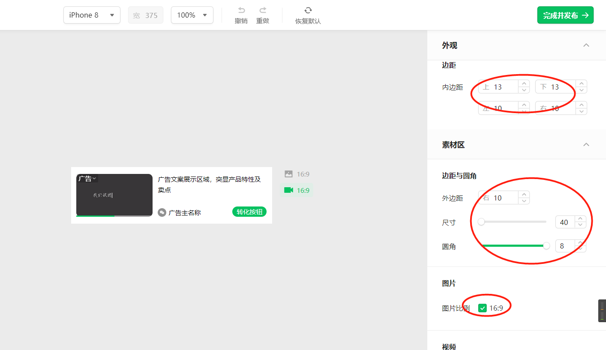
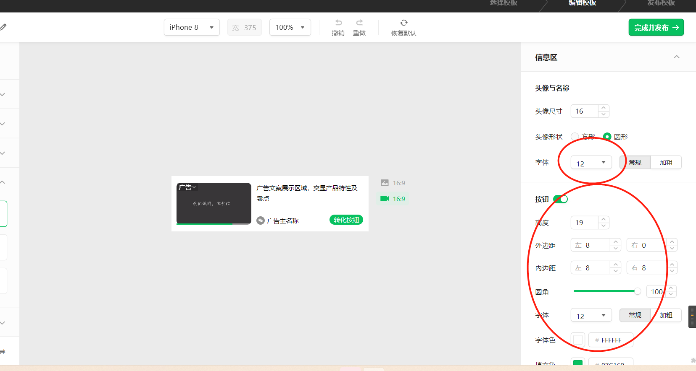
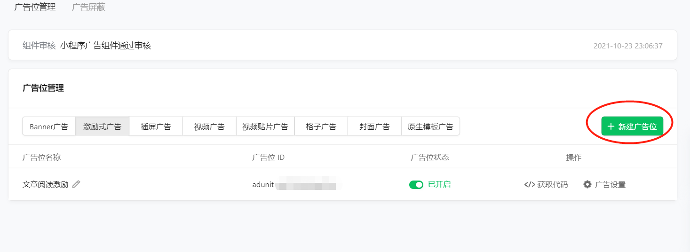
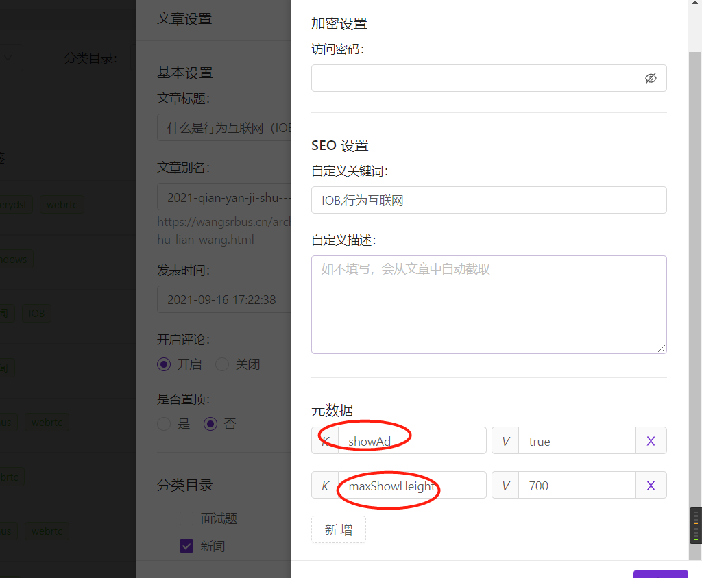

#  小程序配置


## 从git仓库下载[稳定包](https://github.com/wangsrGit119/mini-blog-halo/releases)或者稳定分支[源码](https://github.com/wangsrGit119/mini-blog-halo)，用微信开发工具打开源码
 > `注意：master分支是最新的代码，如果想要体验最新的未发布版本，直接拉取主分支即可，正常来说主分支的代码均可稳定运行`
## **基础配置**

> `项目路径` -> `app.js `文件中

 - `domain`:'https://blog.wangsrbus.cn',//博客地址
 - `baseUrl`: 'https://blog.wangsrbus.cn/api', //博客api地址
 - `api_access_key`:"xxx", //token
 - `loading_img`:"",加载中gift
 - `empty_img`:"",//空白gift
 - `title`:"Hi,I'm suke",//自定义title
 - `shareName`:'suke’s share',//小程序分享名称
 - `openComment`:true,//是否开启评论 true为开启 false为关闭 -----------  云端控制请到halo后台配置系统变量 key:suke_wechat_comment value:show/noshow
 -  `index_art_style`:'card01', //首页最新文章样式 内置：card01/card02
 - `openAd`:true,//流量主开通则打开
 - `unitId`:'xxxxxxxxx',//原生模板广告ID  自定义的时候自己可以选择样式
 - `unitId2`:'xxxxxxxxx',//视频激励广告--用于文章设置观看视频阅读更多功能
 - `customSlug_one_title`:'科技动态',//分类自定义标题 【小程序展示title】
 - `customSlug_one`:'新闻',//分类 【halo文章的分类名称】
  
 - `sheetId`:34,留言板ID----需要数据库去查询或者F12查看网页端留言页面的id或者去后台管理找到页面F12 然后查看network 还不会的话请联系博主帮助

----


## 跳转公众号文章配置

发表文章时在halo后台配置`元数据`：key为 `gzhURL` value为：`公众号文章链接`




## 海报生成的二维码配置

> `项目下路径` > `images` > `wechat-q-code.jpg`替换成自己的二维码   

## 流量主配置

 - 登录后台，开通流量主
 - 按照下面创建`原生模板广告`和`激励式广告`

> `原生模板广告`,注意修改样式 保证和文章列表渲染匹配
 
 
 
 

> **激励式广告，这个和halo文章设置元数据有关，因为需要您在发布文章的时候指定参数如下**

- 微信后台创建广告

  
- halo后台创建元数据
  
  - `showAd`: `true/false`  是否展示激励广告
  - `maxShowHeight` `number类型的数字`  对应文章在展示激励广告时可见内容高度  `不设置默认在1500`
  

 - 复制对应的广告id填写到app.js配置文件中
 
```javascript
     openAd:true,//流量主开通则打开
      unitId:'adunit-11111',//原生模板广告ID  自定义的时候子集可以选择样式
      unitId2:'adunit-22222222',//视频激励广告--用于文章设置观看视频阅读更多功能
```
